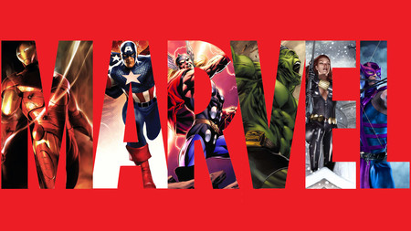

# 1 HTML

# 1.Estructura básica
`DOCTYPE` Tipo de documento, html
~~~html
<!DOCTYPE html>
~~~
`Head` cabecera de la página, `title` el el título que parece en la página web
~~~html
<html lang="en">
<head>
    <meta charset="UTF-8">
    <meta http-equiv="X-UA-Compatible" content="IE=edge">
    <meta name="viewport" content="width=device-width, initial-scale=1.0">
    <title>Mi paǵina web</title>
</head>
~~~
`body` Información que se visualizará en el navegador del ordenador.

~~~html
<body>
    
</body>
</html>
~~~

# 2. Titulares, parrafos, negrita, italic y comentarios
Lo título va desde `h1` hasta el `h6`, el unos es que mayor letra tiene el 6 el más pequeño
~~~html
<h1>Título 1</h1>
<h2>Título 2</h2>
~~~
Párrafo
~~~html

Párrafo 1

Párrafo 2

~~~
Negríta
~~~html

Párrafo <b>1</b>

~~~
Cursiva
~~~html

 <i>Párrafo</i> 2

~~~

# 3. Listas

`ol`Listas ordenadas
~~~html
 <ol>
        <li>Elmento 1</li>
        <li>Elmento 3</li>
        <li>Elmento 3</li>
    </ol>
~~~
`ul` Listas desordenadas
~~~html
    <ul>
        <li>Rojo</li>
        <li>Verde</li>
        <li>Naranja</li>
    </ul>
~~~
# 4. span y div
`span` aplicamos un fortmato
~~~html

Esto es un texto en color rojo

~~~
`div` Contenedor de inforamción
~~~html

        <h1>Titular dentro de div con color azul</h1>
        
Color azul

    

~~~

# 5.Incluir una imagen y un enlace a otra página web

`img` etiqueta para imágenes, alt es el texto que sale si no se carga bien la imagen.
Cargar imágen desde local
~~~html

~~~
Cargar imágen desde internet
~~~html

~~~
Una imágen que cuando clicamos en ella nos lleva a una paǵina web
~~~html
 
~~~

# 6. Tablas
`tr` filas 
`td` columnas
~~~html 

<table>

  <tr>

    <td>Celda 1</td>

    <td>Celda 2</td>

    <td>Celda 3</td>

  </tr>

  <tr>

    <td>Celda 4</td>

    <td>Celda 5</td>

    <td>Celda 6</td>

  </tr>

</table>
~~~

# 7. Formularios
Si ponemos tipos `emial`, si no escribes bien un emial da error
y la `password` no se muestra.
Con `required` el campo se hace obligatorio para poder hacer la acción
~~~html
 <form class="" action="resultado.html" method="POST">
        <h3>Introduzca su nombre y apellido</h3>
        <input type="text" name="nombre" placeholder="nombre">
        <input type="text" name="apellidos" >
        <input type="submit" name="enviar" value="Enviar">
        <input type="email" name="email" placeholder="email" required>
        <input type="password" name="password" placeholder= "password" required>
        <input type="submit" name="enviar"  value="Enviar">
    </form>
~~~
Botón radio
~~~html
 <form action="resultado.html">
        <h3>¿Qué color te gusta?</h3>
        Verde <input type="radio" name="color" value="verde">
        Rojo <input type="radio" name="color" value="rojo">
    </form>
~~~